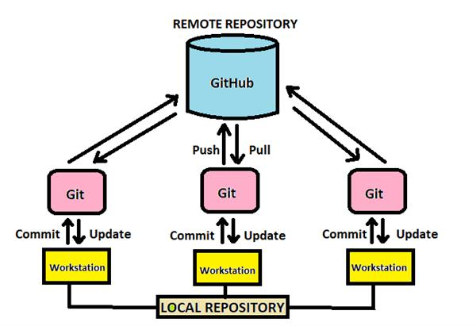

# Git_Theory
Git_Theory

## What is version controll 
- Version control, also known as source control, is the practice of tracking and managing changes to software code. Version control systems are software tools that help software teams manage changes to source code over time.

## What is git
- Git is a distributed version control system that tracks changes in any set of computer files, usually used for coordinating work among programmers collaboratively developing source code during software development. Its goals include speed, data integrity, and support for distributed, non-linear workflows.

## Benefits of git
- Perfroms very well and reliably compared to other version controll osftwear 
- Git is designed specially to maintain the integrity of the source code
- it is very flexible 

## Why is git good for DevOps
- Git allows multiple developers to be wroking on the same project at the same time and allows them all to see what updates are being made and what they are doing exactly. 

## What is GitHub and whats is the difference between it and git
- GitHub is a for-profit company that offers a cloud-based Git repository hosting service. Essentially, it makes it a lot easier for individuals and teams to use Git for version control and collaboration.
- While Git is a tool that's used to manage multiple versions of source code edits that are then transferred to files in a Git repository, GitHub serves as a location for uploading copies of a Git repository. In a sense, then, there's no comparison when it comes to Git vs. GitHub as far as their function.

## How to transfer files from one account to another 
- First get there git hub repo and clone it to vscode one you have it cloned make your you are in the correct file so you will need to cd into the main file you need. 
- then you should use this command to push the file tp your account `git push --mirrior  and then have you url with your repo at the end`
- then run this and it should push everything to your account 